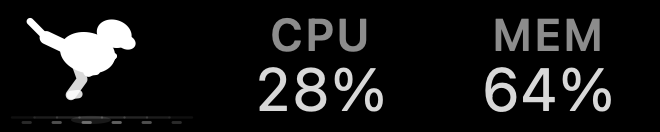
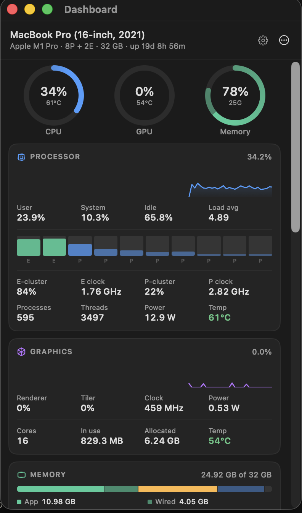
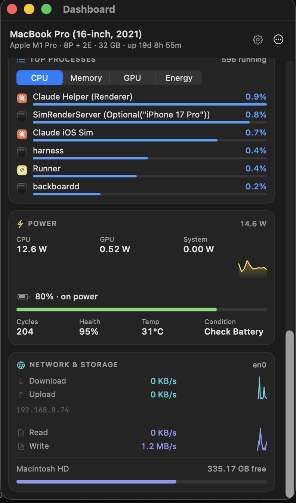
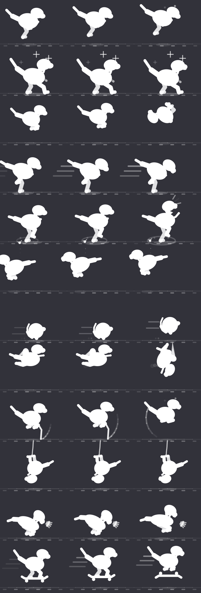

# Rex Boing

[](https://github.com/rexyrex/Rex-Boing/actions/workflows/ci.yml)
[](LICENSE)

A macOS menu bar telemetry app. A tiny tyrannosaur runs in your menu bar and
quickens when your Mac is busier, with a dashboard behind it that reports
considerably more about the machine than a menu bar monitor usually does.

Built for Apple silicon, degrades gracefully on Intel.






## Installing

Requires macOS 14 Sonoma or later. Apple silicon gets every reading; on Intel
the rows whose counters do not exist there are hidden rather than faked.

**Download.** Notarized builds are published on the
[Releases](https://github.com/rexyrex/Rex-Boing/releases) page. Unzip
`Rex Boing.zip`, drag `Rex Boing.app` into `/Applications`, and open it. The
release build is signed with a Developer ID and notarized, so Gatekeeper lets
it through without any workaround.

**Or build it yourself.** Two commands, given Xcode and Homebrew:

```bash
brew install xcodegen
./build.sh --install
```

That generates the Xcode project, builds Release, copies the app to
`/Applications` and launches it. Leave off `--install` to keep the app in
`dist/` instead.

Either way the rex appears in the menu bar. Click it for the dashboard,
right-click for the character gallery and settings, and turn on **Launch at
login** in Settings if you want it to stay. The app makes no network
connections and asks for no permissions: everything it shows is read through
unprivileged system APIs, so there is no helper tool and no password prompt.

## Why a tyrannosaur

This started as the obvious thing — a little cat, running, the way
[RunCat](https://github.com/runcat-dev/RunCatNeo) does it — and it was rebuilt
twice before being abandoned. The problem is not that a small animal is hard to
draw. It is that a figure has to *read as something*. At nineteen points tall a
cat is about forty pixels of silhouette, and every one of them is spent on the
viewer deciding whether it is a cat; the motion is judged against how a cat
actually moves, and it always loses.

The first shipped answer was abstract fields — waves, a twisting helix, a
comet, a pendulum row — which have nothing to be recognised as. They were
legible, smooth, and nobody's favourite. What replaced them, and what stuck,
is a single chibi tyrannosaur that dodges the original objection two ways: a
solid Chrome-dino-style silhouette is simple enough to spend nothing on
recognition, and every animation moves the *whole* silhouette — bounce,
travel, rotation, squash — because at this size limb motion alone is a rumour.

There are sixteen of it. A gallop; a disco point; a jump that turns into
backflips past two-thirds load; a full-width dash; a kaiju stomp that lands a
shockwave with every footfall and roars past two-thirds; a fly chase with a
leap and a snap that never quite connects; a wind-up-and-roll that crosses
the bar as a ball; a jetpack swoop that picks up a mid-air loop under load;
a skipping rope that whips right round the figure every hop and goes twice
round past two-thirds; a bungee drop from above the bar that boops the floor
nose-first on every bounce; a sneeze wound up over half the cycle and let go
all at once, hard enough under load to blow the rex off its feet; and a
skateboard run — push, ollie, kick-turn — whose ollie spins the deck a full
turn past two-thirds. The gallery also includes Dragon (wings and fire), Ninja
(sword strikes and a trailing headband), Surf (carving waves), and Lift
(barbell presses and squats). All of them are pure functions of `(time, load)` on
the same colour ramp and pace curve, eyes blinked on a deterministic clock,
and one headless check covers the lot. Everything below is drawn by the same
code that draws the menu bar, at the same proportions:



Top to bottom: gallop, point, jump, dash, stomp, chase, roll, jetpack, skip,
bungee, sneeze, skateboard. Left to right: idle, working, flat out.

The larger 36-point-wide menu bar slot gives the rex a broader silhouette, a
squared muzzle and clearer eyes. Settings → Menu Bar has a selectable gallery
and a live preview; all existing animation selections remain compatible.

## What it shows

**Menu bar** — a visualiser whose pace, intensity and colour track CPU load,
plus any combination of live readouts: CPU, GPU, memory, swap, CPU/GPU
temperature, system power, network throughput, disk throughput, battery.

Colour is held back for the top of the range: up to seventy percent the
field stays in the menu bar's label colour and only its pace changes. Above
that it fades into orange by eighty and deepens continuously to red at full
load, rather than stepping the way the readouts' severity tints do. Monochrome
mode opts out of it and keeps the label colour throughout.

**Dashboard** (click the item)

| Card | Contents |
| --- | --- |
| Processor | Total / user / system / idle, load average, per-core bars split by E- and P-cluster, per-cluster average clock with a history trace each — throttling made visible as the clock sags while the die temperature peaks — package power, die temperature, process and thread counts |
| Graphics | Device / renderer / tiler utilisation, GPU clock, GPU power, core count, mapped and allocated memory, GPU temperature |
| Memory | App / wired / compressed / cached breakdown, kernel memory-pressure level, free, inactive, purgeable — **and swap**: used, free, page-in and page-out rates, encryption state |
| Thermals | CPU, GPU, peak and battery temperatures, fan speeds against their rated range, OS thermal-pressure state, and every individual sensor (186 on an M1 Pro) grouped by subsystem |
| Top processes | Ranked by **CPU, memory, GPU, energy or disk I/O**, with app icons; right-click to reveal, copy or quit |
| Power | Whole-machine draw as the headline and history graph — the SMC's system rail, so fans, display and SSD count, on mains as well as on battery — beside per-component CPU / GPU / Neural Engine / SoC package tiles and the live DC-in draw, battery charge, cycle count, health, cell temperature and condition — and **who is keeping the Mac awake**: every process holding a display- or system-sleep assertion, with its own stated reason in the tooltip |
| Network | Up/down rates with history and session totals, primary interface and local address |
| Storage | Read/write rates with history and session totals, volume capacity |

The GPU and disk tabs of the process list are the unusual ones — per-process
GPU attribution is not something menu bar monitors normally expose, and it is
usually the quickest way to find out what is keeping the GPU awake. The disk
ranking counts traffic that actually reached the device, so reads served from
the page cache do not inflate it, and it is the fastest answer to "what is
hammering the SSD".

**Process breakdown** (click any graph)

The graphs provoke a question the cards cannot answer: *that* spike, two
minutes ago — what was that? Clicking a trace opens a window on the instant
under the pointer, listing every process that placed in any of the five
rankings at that moment with all five measures side by side — plus wakeups a
second, the classic energy-bug tell — sortable by any of them. Arrow keys and
the scrubber walk the retained window a sample at a time, and a Live toggle
rides the newest one.

It leads with the system-wide total for the resource on show — CPU load across
all cores, GPU utilisation, memory used against installed, system power in
watts — and a picker switches between them without going back to the dashboard
to click a different trace. The total is recorded per sample rather than summed
from the rows, because the two are on different scales: per-process CPU is a
percentage of one core and routinely exceeds 100, while the system figure is a
fraction of all of them. Hovering the total spells that out, along with the
other two reasons the column will not add up to it — kernel and interrupt time
belongs to no process, and processes too quiet to rank are not listed.

### The per-process CPU counters are not nanoseconds

`proc_taskinfo`'s `pti_total_user` and `pti_total_system` come from
`TASK_ABSOLUTETIME_INFO`, and absolute time means whatever `mach_timebase_info`
says it means. On Intel that ratio is 1:1, so treating the counters as
nanoseconds is correct there and the mistake never shows. On Apple silicon a
tick is 41.67 ns, and the same arithmetic understates every process by a factor
of forty — a thread spinning flat out on one core reports 2.4% instead of 100%.

Worth knowing because it is invisible without something to check against: every
row is wrong by the same factor, so the ranking is right, the shape is right,
and nothing looks broken. It surfaced only when the process column was totalled
and compared against `host_processor_info`, which has no such ambiguity. With
the conversion applied, three processes each pinned to a core read 100.2%, and
the summed column accounts for about three quarters of the system figure — the
rest being kernel and interrupt time, which belongs to no pid.

The GPU counter, checked the same way, really is nanoseconds: driving the GPU
from a single process reads 88% against a device utilisation of 98%.

The wakeups column sits on the same struct and has its own trap: the obvious
field is `ri_pkg_idle_wkups` — the one Activity Monitor's Intel-era "Idle Wake
Ups" column is named after — and on Apple silicon it is simply not accounted.
It reads zero for every process, forever, which looks exactly like a quiet
machine. `ri_interrupt_wkups` is the counter that works, and it works exactly:
a thread sleeping at 100 Hz measures 100 a second, on both architectures.

The header says which instant is actually on screen. While nothing is watching,
the process table is sampled roughly every six seconds rather than every tick, so the
nearest retained sample can genuinely be a few seconds off the point that was
clicked — the window states the gap rather than quietly showing a different
moment than the one you pointed at.

## Where the numbers come from

Everything runs unprivileged. No helper tool, no `sudo`, no `powermetrics`.

| Metric | Source |
| --- | --- |
| CPU, per core | `host_processor_info`, differenced between samples; task/thread totals from `processor_set_statistics` |
| Memory, swap | `host_statistics64`, `vm.swapusage`, `kern.memorystatus_vm_pressure_level` |
| GPU utilisation, VRAM | `IOAccelerator` → `PerformanceStatistics` in the IORegistry |
| Temperatures, fans | AppleSMC user client (`Tp**` CPU, `Tg**` GPU, `Te**` E-cluster, `Tm**` memory) |
| Per-component power, CPU/GPU clocks | `IOReport` energy counters and DVFS state residency |
| Whole-machine power | AppleSMC system rails — `PSTR` total, `PDTR` DC-in |
| Per-process CPU / memory / energy / disk I/O / wakeups | `libproc` — `proc_pidinfo`, `proc_pid_rusage` |
| Per-process GPU | `IOUserClientCreator` + `AppUsage.accumulatedGPUTime` per accelerator client |
| Battery | `IOPowerSources` and `AppleSmartBattery` |
| Sleep assertions | `IOPMCopyAssertionsByProcess` — the same source `pmset -g assertions` reads |

Two of these are private API bound at runtime with `dlsym`: `IOReport` (power
and clocks) and `IOHIDEventSystemClient` (a fallback sensor path used only when
the SMC is unavailable). Both are optional — if either fails to resolve the app
hides those rows instead of misreporting. Settings → About lists which sources
resolved on your Mac.

### Sensor classification

Apple publishes nothing about SMC key meanings, so the CPU/GPU split was
established empirically: load each unit in isolation and watch which sensors
respond. Worth recording, because the obvious approach is wrong — the HID
sensor names (`PMU tdie4`, `PMU TP1g`) are so thermally coupled on an M1 Pro
that a pure GPU load warms the "CPU" probes just as much as a pure CPU load
does. The SMC key space is unambiguous where the HID names are not, so that is
what the app uses.

Note also that Apple silicon reuses Intel-era uppercase prefixes for unrelated
sensors — `TCMz` on an M1 Pro is not a CPU die sensor, and treating it as one
pulls the CPU average up by several degrees. Classification is therefore
architecture-aware.

### Energy channels are a tree, not a list

The same trap sits in IOReport's `Energy Model` group, and it is easier to fall
into because the channel names look flat. An M1 Pro publishes, side by side:

```
PACC0_CPU3    one performance core
PACC0_CPU     one performance cluster
CPU Energy    the whole CPU
PCPUDTL0e     one DVFS state of one cluster
```

All four describe the same joules at different granularities. Summing every
channel whose name contains `CPU` therefore counts the same energy three or
four times over — measured at 3.6× the true figure on an M1 Pro, and 2.1× for
the GPU, which is enough to turn a 5 W idle into a plausible-looking 18 W. Only
the whole-unit roll-ups are counted, with the cluster level kept as a fallback
for chips that do not publish one.

## Cost

Measured on an M1 Pro, Release build, against a deliberately saturated machine
(eight busy cores, so the visualiser is at its maximum pace), 1 s refresh, with
the menu bar on a 5120×1440 120 Hz display:

| Configuration | CPU |
| --- | --- |
| Shipping defaults (Smooth animation, 30 fps) | **~1.4% of one core** |
| Fluid animation (60 fps) | ~3.5% |
| Economical animation (15 fps) | ~1.0% |
| Animation off | ~0.6% |
| Dashboard open | ~11% |

Sampling is most of the resting cost. Thirty frames a second of visualiser adds
about eight tenths of a point.

Retaining process history for the breakdown window is close to free, because
the expensive part was already being paid and then thrown away. A full process
sample — a `proc_pidinfo` and a `proc_pid_rusage` for each of roughly a
thousand processes, plus a recursive IORegistry walk for GPU attribution —
measures 11.9 ms; deduplicating the rankings into the union that gets kept
and appending it to the ring adds 0.05 ms, or 0.44% of the sample it rides on.
The union runs 32–36 rows, so ninety of them cost about 330 KB of numbers, with
name and path strings shared across samples rather than rebuilt per sample.

The dashboard figure is the outlier and is worth stating plainly: a panel with
eight live cards, seven graphs, a per-core grid and a ranked process list costs
roughly what Activity Monitor's own window does, and almost
all of it is SwiftUI re-evaluating and re-rasterising that tree once per
sample. It applies only while the popover is actually on screen, which for a
transient popover is a few seconds at a time. The things that used to make it
worse — ranking several hundred processes four times over inside the view body,
re-grouping 186 sensors on every render, and three animating conic gradients in
the headline rings — were doing that work on the main thread and are gone; the
rings themselves have since followed, their numbers moved onto the cards that
already graph the same series.

The animation cost is worth explaining, because it is not what you would guess.
It is almost entirely *per frame update*, not per pixel: setting a status
item's `image` runs NSButtonCell's invalidation path and makes AppKit push
fresh scene settings to the window server, then wait on a CoreAnimation fence.
Caching frames, caching text layout and pinning the item's length all barely
moved the number, because none of them avoid that path — only drawing fewer
frames did, at about a quarter of a percent of a core per frame per second.

Drawing one frame, by contrast, is cheap and stays cheap: 58–84 µs across the
twelve characters, at menu bar size on an M1 Pro. Getting there meant dropping
`NSBezierPath` — every one of those allocates and then converts itself to a
`CGPath` to be stroked — and setting colours from components rather than
building an `NSColor` per alpha; when the first visualisers were written,
feeding the context its points directly halved the cost of a frame.

The way out is to stop going through `image` at all. The visualiser lives in a
`CALayer` the app owns on the button, and a frame becomes one `setNeedsDisplay`
on a sublayer: a plain CoreAnimation update with no invalidation, no re-measure
and no fence.

Which layer API you use matters too. Rendering into an app-owned bitmap and
assigning the result to `contents` hands CoreAnimation a brand new `CGImage`
sixty times a second, each of which it has to take ownership of and upload;
acting as the layer's *delegate* instead lets it keep one backing store for the
life of the layer and call back to fill it. Same pixels either way, and one
fewer surface per frame for the compositor to adopt.

One consequence worth knowing: a layer's contents are not template-rendered, so
monochrome mode draws in `labelColor` directly instead of drawing black and
letting AppKit tint it. Same result, one less thing happening per frame.

### Making it smooth

Cheap frames are not the same as smooth ones, and three things had to change
before the menu bar stopped looking like a flip-book.

**The clock.** A timer at 12 Hz against a display refreshing at 60 or 120 beats
against it: frames land unevenly however precisely they are scheduled, and that
stutter reads as far worse than a low frame rate. Everything is driven by a
`CADisplayLink` off the status button instead, so every frame lands on a
refresh, and `preferredFrameRateRange` lets the system pick a cadence it can
actually deliver rather than the app guessing at one.

**The frame budget.** The rate is derived from the motion rather than pinned:
the link is asked for roughly the number of frames the current pace wants,
floored so a resting field still drifts rather than ticking, and capped by the
quality setting. What that setting buys is *frames per cycle* — raising the
ceiling alone would achieve nothing, because none of the visualisers ask for
more than about two cycles a second and a 60 fps ceiling would simply never be
reached.

**The load itself.** CPU is sampled once a second, and a visualiser whose speed
and amplitude are read straight off that sample visibly jolts every time one
lands. The drawing follows an exponentially smoothed load with a half-second
time constant, so the pace glides between samples instead of stepping at them.

The drawing is a pure function of `(time, load)` — no accumulated state, no
random numbers. Which means any frame can be reproduced exactly, off screen, and
the figures above are rendered by the same code the menu bar runs rather than
screenshotted from it.

It also means the drawing path can be checked without a menu bar, which
`Tools/visual-check.swift` does: it drives the real `CALayer` delegate for every
visualiser and compares what CoreAnimation produced against the same instant
rendered directly, pixel for pixel.

```bash
swiftc -O -o /tmp/visual-check Tools/visual-check.swift \
  RexBoing/StatusBar/Visualizer.swift RexBoing/StatusBar/VisualCanvas.swift && /tmp/visual-check
```

That is a narrower check than it sounds, and it earns its place: the two worst
bugs in this area were a bitmap whose scale was set one line too late, so
everything drew at half size in the corner of the frame, and a layer that was
never marked dirty. Both are invisible to a compiler and obvious to this.

The colour ramp has a check of its own, `Tools/ink-check.swift`, which pins
down what the eye cannot confirm on a live menu bar: the label colour comes
back untouched all the way to the seventy percent line, the fade into orange
starts from the neutral rather than popping, and the walk from orange to red
never reverses or greys out.

```bash
swiftc -O -o /tmp/ink-check Tools/ink-check.swift \
  RexBoing/UI/Theme.swift RexBoing/Metrics/Snapshot.swift RexBoing/Metrics/Format.swift && /tmp/ink-check
```

## Building

Requires Xcode 16 or newer and [XcodeGen](https://github.com/yonaskolb/XcodeGen)
(`brew install xcodegen`). The Xcode project is generated from `project.yml`
and is not checked in, so the first step after cloning is always:

```bash
./build.sh
```

That regenerates the project, builds Release, and drops `Rex Boing.app` in
`dist/`; `./build.sh --install` additionally copies it to `/Applications` and
relaunches it, replacing any copy already in the menu bar. To work on it in
Xcode:

```bash
xcodegen generate && open RexBoing.xcodeproj
```

The app is ad-hoc signed and **not sandboxed** — the sandbox blocks the Mach
host ports, whole-system `libproc` access and IORegistry reads the whole app is
built on. It makes no network connections and writes nothing outside its own
preferences domain.

### Checks

There is no test target; instead `Tools/` holds seven small programs that
compile against the app's own source files and exercise them headlessly, and
one script that runs them all:

```bash
Tools/check.sh          # everything
Tools/check.sh --pure   # only the checks that never read live hardware (what CI runs)
Tools/check.sh visual   # one by name: visual ink readout clock ledger metrics engine
```

Four are deterministic — the drawing path, the colour ramp, the readout
widths, and the history buffers and ledger against a synthetic timeline — and
must pass everywhere. The other three sample the machine they run on, so their
readings differ per Mac by design; what they assert is availability, finiteness,
ranges and internally consistent counts. Run the whole set before opening a
pull request.

### Icon

The app icon is the resting rex on a blue plate, drawn by the same code that
draws the menu bar. `RexBoing/Assets.xcassets/AppIcon.appiconset` is
generated, not hand-made — regenerate it after changing the rex with:

```bash
swiftc -O -o /tmp/render-icon Tools/render-icon.swift \
  RexBoing/StatusBar/Visualizer.swift && \
  /tmp/render-icon RexBoing/Assets.xcassets/AppIcon.appiconset
```

### Releasing

`package.sh` builds Release, signs it with a Developer ID certificate and the
hardened runtime, submits it to Apple for notarization, staples the ticket and
leaves `dist/Rex Boing.zip` ready to attach to a GitHub release. It needs an
App Store Connect API key, read from a gitignored `notarize.env`:

```bash
cp notarize.env.example notarize.env   # then fill in your Key ID, Issuer ID and key path
./package.sh
```

## Notes

- Right-click the item (or ⌃-click) for a menu: the character gallery with
  a live checkmark, a toggle for the visualiser, a shortcut to the process
  breakdown, Settings, About and Quit.
- If you use a menu bar manager (Bartender, Ice, Hidden Bar) or have a full
  menu bar on a notched display, Rex Boing may land in the collapsed section —
  expand it to see the visualiser.
- Fan rows are hidden on fanless Macs; GPU rows are hidden where no accelerator
  reports statistics. Nothing is faked.
- Reduce Motion is honoured — the visualiser holds a still frame.
- The animation pauses while the display is asleep.

## Layout

```
RexBoing/
  App/            entry point, preferences, login item, About panel
  Metrics/        Snapshot model, history buffers, usage ledger, formatting
    Samplers/     one file per data source
  StatusBar/      visualisers, layer canvas, readout renderer, status item
  UI/             dashboard, cards, components, process inspector, settings
  Assets.xcassets generated app icon
Tools/            headless checks (run them all with Tools/check.sh) and the
                  app icon generator
docs/             images for this README
project.yml       XcodeGen spec; RexBoing.xcodeproj is generated from it
build.sh          generate + build Release (+ --install to /Applications)
package.sh        sign, notarize and zip a release (maintainers)
```

## Contributing

Issues and pull requests are welcome. Before opening a PR, run `./build.sh`
and `Tools/check.sh` and make sure both pass; if you change a visualiser,
regenerate the icon and the README figures with the tools above so they stay
true to the code. Keep the tone of the comments: they explain *why* a thing is
done the way it is, especially where the platform behaves differently from
what the documentation implies — that reasoning is most of what makes this
codebase readable.

## License

[MIT](LICENSE).
